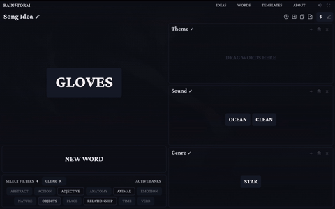
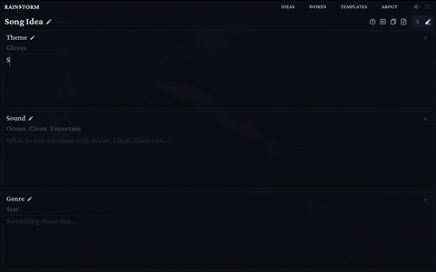
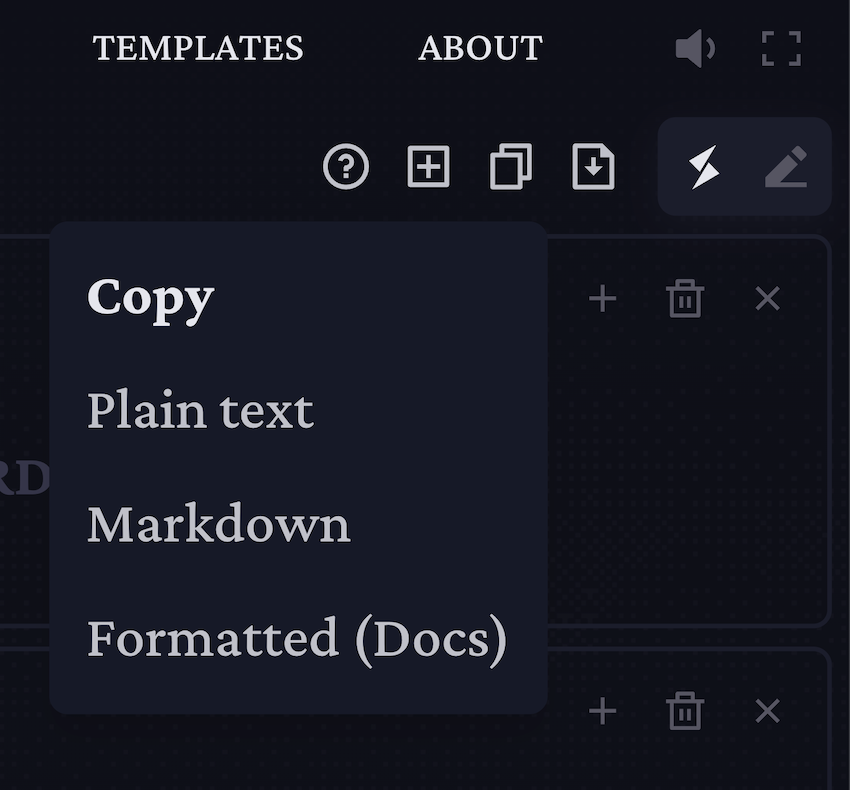

<div align="left">
  
</div>

#### _The one word, creative writing ideation tool [Try it!](https://rainstorm-project.vercel.app/)_

_By David Kjellstrand_

[](https://www.linkedin.com/in/david-kjellstrand-b6760113a/) [](https://www.github.com/davkje)

Rainstorm is a web-based creative writing tool designed to help you quickly generate and define ideas without getting lost in the details. Instead of producing ideas for the user, RainStorm uses randomness, visual organization, and intentional constraints to encourage interpretation, association, and independent creativity.

This project was developed as a **Degree Project for the Front End Developer program (FED24)** at **Medieinstitutet**.


## Links

🌐 [Live Demo](https://rainstorm-project.vercel.app/)

📦 [Repository](https://github.com/Davkje/rainstorm-next)

## Table of Contents

- [About](#about)
- [Project Overview](#project-overview)
- [Tech Stack](#tech-stack)
- [Features](#features)
- [Application Flow](#application-flow)
- [Accessibility](#accessibility)
- [Setup](#setup)
- [Installation](#installation)
- [Reflections](#reflections)

## About

Inspired by role-playing games like Dungeons & Dragons, where “roll-tables” provide random prompts to spark improvisation, Rainstorm similarly provides a framework that challenges users to create meaning themselves. It is intentionally lightweight and deliberately avoids AI-generated content.  
Rather than providing fully formed or predictive ideas, the tool is designed to encourage users to associate, interpret, and ideate on their own.

The focus of the application is to help users arrive at the _first clear seed of an idea_. Once that foundation is in place, the idea can be freely developed further using any tools or production workflow the user prefers.

## Project Overview

Users work through ideas in two modes:

**Ideate** – Explore and associate ideas visually using random words and accessible drag-and-drop features.

**Define** – Clarify and structure ideas through short, descriptive text.

## Tech Stack

- **Framework:** Next.js
- **Language:** TypeScript
- **Styling:** Tailwind CSS
- **Animations:** Framer Motion
- **Drag & Drop:** dnd-kit
- **UI & Accessibility:** Radix UI, focus-trap-react
- **Audio:** Howler.js
- **Export:** jsPDF (PDF), TXT export
- **State & Storage:** Client-side state + Local Storage
- **Hosting:** Vercel

[](https://skillicons.dev)

## Application Flow

1. **Create a project** using preferred template
2. Start in **Ideate mode**:

- Generate random words with preferred banks and filters
- Drag and organize words into categories
- Edit categories and project if needed



3. Switch to **Define mode**:

- Each category is presented in a structured editable text view
- Write short descriptions, connecting words to the idea and category



4. **Export or copy** the finished idea for further development

<div align="left">
  
</div>

## Features

- Project creation using predefined templates (Empty, Song, Story, Game, etc.)
- Random word generation from multiple word banks (Server Side API Routing)
- Active and filtered Wordbanks
- Editable categories with drag-and-drop word organization
- Fully keyboard-accessible interactions
- Two-mode workflow: **Ideate** and **Define**
- Help section, tutorial hints and Custom Tooltips
- Multiple export and copy options
- Local storage persistence (no login required)
- Rain ambiance audio with mixer.

<div align="left">
  
</div>

## Accessibility

Accessibility has been considered according to the **European Accessibility Act (2025)** and guided by the **A11y Project checklist**.

Key measures include:

- Full keyboard navigation
- Clear and visible focus states
- Sufficient color contrast
- Semantic HTML and ARIA labels where appropriate

All core functionality is accessible without a mouse, including drag-and-drop alternatives.

## Setup

This project requires **Node.js**.

Clone the repository:

```bash
git clone https://github.com/Davkje/rainstorm-next.git
cd rainstorm-next
```

## Installation

Install dependencies:

```bash
npm install
```

Run the development server:

```bash
npm run dev
```

Build for production:

```bash
npm run build
npm start
```

## Conclusion

RainStorm successfully meets its goal of supporting early-stage creative ideation through randomness, structure, and constraints. The project demonstrates how thoughtful interaction design can encourage creativity without relying on AI-generated content.

While there is room for future expansion—such as user accounts or long-term storage—the current version stands as a complete, production-ready prototype that fulfills the scope of the degree project.
